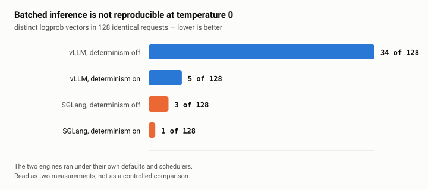
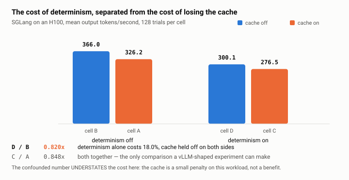
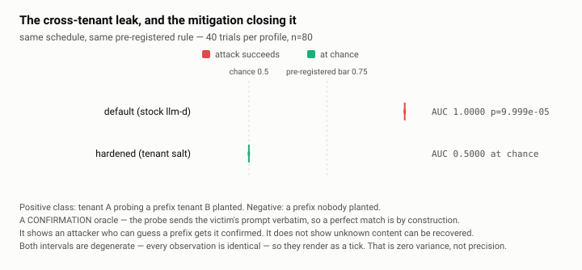
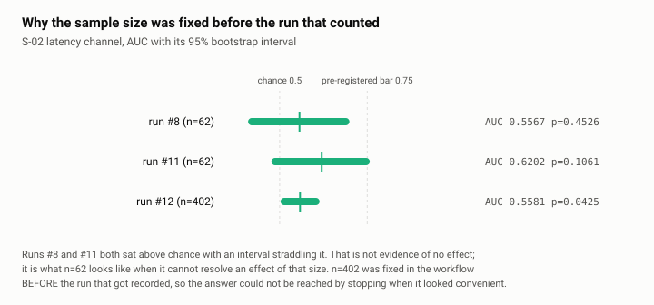

# Results

Everything this project measured, in the order it becomes interesting, with what
each number does and does not support.

Every figure is generated by `scripts/make_figures.py` from
`bench/results/measurements.json` and never edited by hand. Every number in that
file names the writeup it came from, and `tests/test_published_numbers.py` fails
the build if the prose in `README.md` or `docs/SHIP-REPORT.md` drifts away from
it. Regenerate with:

```bash
uv run python scripts/make_figures.py
```

---

## 1. Batched inference is not reproducible, and the fix is partial

<picture>
  <source media="(prefers-color-scheme: dark)" srcset="figures/divergence-dark.svg">
  
</picture>

Send the same prompt 128 times at temperature 0, seed fixed, and count how many
distinct logprob vectors come back. On vLLM the answer is **34 of 128**. The requests
are identical; what differs is which other requests happened to be batched
alongside them, and floating-point reduction order is not associative.

**Why a model validator cares.** SR 11-7 asks an institution to demonstrate that
a model's outputs can be reproduced and explained. An inference stack whose
output depends on the concurrent traffic of unrelated tenants cannot answer that
question, and the platform team is usually the last to know, because at the
application level everything looks fine.

`VLLM_BATCH_INVARIANT=1` cuts 34 to **5**. That is a large improvement and it is
not zero, which is the part worth stating out loud: vLLM's batch-invariant mode
reduces divergence rather than eliminating it. SGLang's deterministic mode
reached **1 of 128** in both of its deterministic cells.

**What this does not establish.** The two engines ran under their own defaults
and schedulers. The gap between 34 and 3 with determinism off is larger than the
determinism question alone explains, and this measurement does not attribute it.
Read the two columns as two measurements, not as a controlled comparison.

*Source: `bench/results/cost-h100-2026-09-07.md`,
`bench/results/sglang-2x2-h100-2026-09-07.md`.*

---

## 2. The cost of determinism is not what the obvious experiment measures

<picture>
  <source media="(prefers-color-scheme: dark)" srcset="figures/cost-decomposition-dark.svg">
  
</picture>

This is the result the project is most pleased with, and it exists because of a
question a reviewer would have asked.

On vLLM, turning determinism on means turning the prefix cache **off** — the two
are not integrated upstream. So the honest reading of "batch invariance costs
22.7% of throughput" is *determinism plus the loss of the cache*, and nothing in
a vLLM-only experiment can separate them. Publishing the confounded number under
the unconfounded name would have been the kind of claim this whole repository is
arguing against.

SGLang runs deterministically **with** its radix cache on. That supplies the
missing cell of a 2×2, and the decomposition follows:

| ratio | value | what it isolates |
|---|---|---|
| **D / B** | **0.820×** | **determinism alone — 18.0%**, cache held off on both sides |
| C / D | 0.921× | the radix cache *costs* 7.9% on this workload |
| C / A | 0.848× | both together, and the only comparison vLLM can make |

**The confounded number understates the cost here.** C/A is 0.848× while the
isolated D/B is 0.820×. A reviewer's instinct is that a confounded figure must be
inflated; on this workload the two effects partly cancel, because every trial
sends the same short prompt so there is almost no prefix to amortise while the
radix tree still does its bookkeeping. That is a property of the workload, not a
finding about SGLang — with long shared system prompts the sign would very likely
flip. The point is that the direction was not predictable from reasoning, which
is exactly why the decomposition was worth $0.47 of H100 time.

*Source: `bench/results/sglang-2x2-h100-2026-09-07.md`, ADR-009.*

---

## 3. The cross-tenant leak, and the mitigation closing it

<picture>
  <source media="(prefers-color-scheme: dark)" srcset="figures/frb03-verdict-dark.svg">
  
</picture>

llm-d routes by prefix affinity: hash the prompt into blocks, prefer the pod that
already holds a matching prefix. In a bank, **the prefixes are the sensitive
part** — probing for a cache hit on *"Analyse the proposed acquisition of
&lt;TARGET&gt; by &lt;ACQUIRER&gt;"* is probing for material nonpublic
information across an information barrier.

The measurement, 40 trials per profile with a fresh nonce each time:

1. tenant B sends `<nonce> <filler>`;
2. tenant A sends the **same text** — positive class;
3. tenant A sends a *different* fresh nonce nobody has sent — negative class.

Same tenant, same key, same length, back to back. The only difference is whether
another tenant had put that text in the router's index. Match ratio is read from
the EPP's own `prefix_indexer_hit_ratio` histogram one request at a time, and the
instrument refuses to record a trial where the counter moved by anything other
than one.

**The hardened zero is not a broken cluster.** The same job's ground-truth step
shows the index matching 401 of 404 lookups on that machine. What goes to zero is
specifically one tenant reaching another's entry.

**Read the scope before quoting the number.** This is a **confirmation** oracle,
not an extraction one. The probe sends the victim's prompt verbatim, so a perfect
match is by construction. It establishes that an attacker who can *guess* a
prefix gets it confirmed by the routing layer — which matters wherever prompts
are predictable, a counterparty name or a document or a template. It establishes
nothing about recovering unknown content. The intervals are degenerate because
every observation is identical, which is zero variance rather than precision, and
`p` sits at the floor of a 10,000-permutation test.

*Source: `bench/results/frb03-run15-2026-09-07.md`, ADR-012.*

---

## 4. What a pre-registered rule is actually for

<picture>
  <source media="(prefers-color-scheme: dark)" srcset="figures/s02-power-dark.svg">
  
</picture>

S-02 asked whether an ordinary API caller can observe anything that
distinguishes a routing cache hit from a miss. The answer on the simulator is
no — but the way that answer was reached is the more useful part.

Two runs at n=62 both put the point estimate **above** chance with an interval
straddling it. That is not evidence of no effect; it is what n=62 looks like when
it cannot resolve an effect of that size. Reporting "no signal" from it would
have overstated the data in one direction, and re-running at 62 until an interval
happened to clear chance would have overstated it in the other. So n=402 was
fixed in the workflow **before** the run that got recorded, and whatever that run
returned was what got recorded.

It returned AUC 0.5581 [0.5026, 0.6138], p=0.0425 — which under the
pre-registered rule (AUC ≥ 0.75, interval clear of chance, p < 0.01) is
**neither** `attack_succeeds` nor `at_chance`. That middle state is deliberate:
`common/stats/decision.py` refuses to collapse it into a binary, because doing so
would let a weak positive be reported as either a success or a clean mitigation
depending on which was convenient. So the honest sentence is **"no oracle", not
"no effect"** — a small real timing difference exists and is nowhere near enough
to classify a single request. On the simulator it is almost certainly queueing
across the two pods that prefix affinity concentrates load onto, since the
simulator does not vary time-to-first-token with cache state at all.

*Source: `bench/results/s02-run6-2026-09-07.md`, ADR-011.*

---

## What is not measured, stated as plainly as what is

- **The client-observable oracle on real vLLM (FR-B-09).** ADR-011 established
  that the *simulator* offers a client nothing, and said so as a property of the
  simulator rather than of llm-d. Real vLLM does vary time-to-first-token with
  cache state. Whether the difference clears the bar from outside the cluster is
  open.
- **Partially-shared prefixes.** FR-B-03's separation is binary because the
  prompts are identical or disjoint. A shared system prompt with differing tails
  would make the match ratio continuous, the intervals non-degenerate, and the
  interesting question *how much* shared prefix an attacker needs.
- **No signed receipt against a real engine.** The ATTEST pipeline is exercised
  end to end against the stub, including a tamper-detection test; the GPU runs
  measured divergence and cost but did not emit receipts.
- **Confidence intervals on the 2×2**, SGLang's Triton backend, and why vLLM's
  batch-invariant mode leaves 5 of 128 where SGLang's leaves 1. That last one is
  the most interesting unanswered question here.

---

## The runs that were wrong

`bench/results/` keeps them, and the ship report tabulates fourteen defects with
what caught each. Four were guards that contained the defect they were written to
catch, which is the most useful thing this project learned about its own methods:

- A guard against running both arms of a cost comparison on one engine **had the
  bug it was written to prevent** — it read a stub-only endpoint, failed open, and
  produced an H100 result reporting the exact opposite of the truth. Caught by a
  32-trial cell finishing in zero seconds.
- S-02 returned `ORACLE VIABLE` **twice** on `x-envoy-upstream-service-time`, a
  per-request millisecond counter that differs between any two requests. Both
  times the refutation was three lines above the verdict in the same output.
- A ground-truth gate died on a 401 and reported nothing; its replacement then
  passed on a metric that proved a plugin *named* prefix had executed and nothing
  about whether the index ever matched.
- Run #13's writeup claimed the proxy's injected identity reached the plugin.
  It did not — Envoy applies route-level header mutations in the router filter,
  after `ext_proc`, so the EPP was reading the client's own header. The
  observation was true and the inference skipped a possibility. The correction is
  appended to that writeup rather than replacing it.

That record is here because a claim about verifiable measurement is worth what
the reader's ability to audit it is worth.
