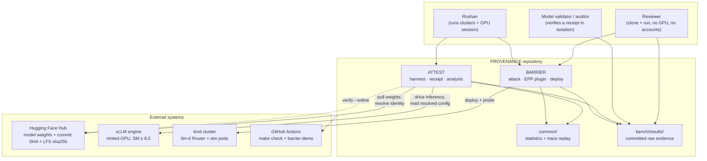
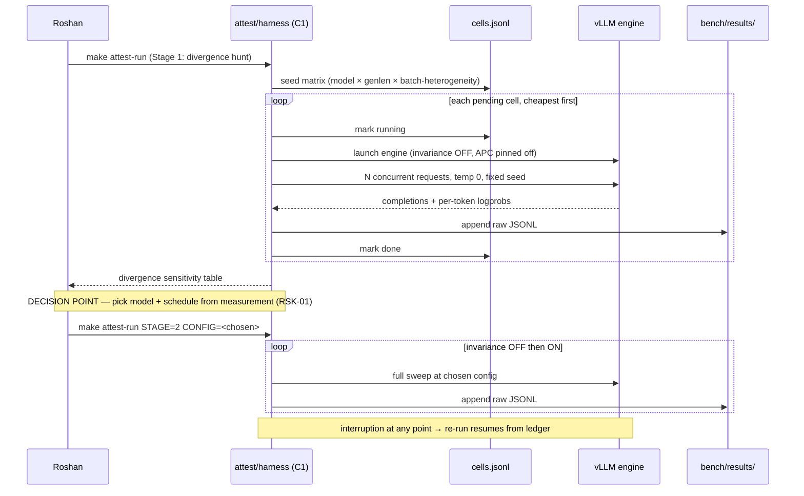
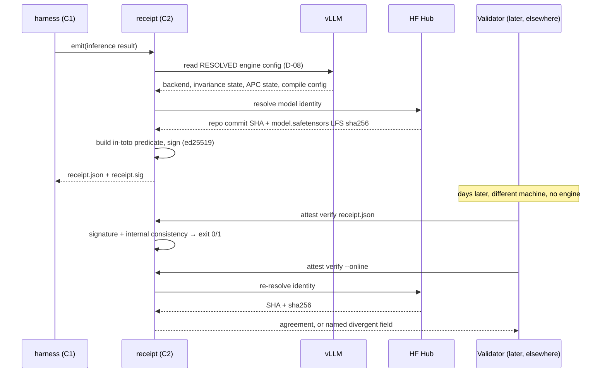
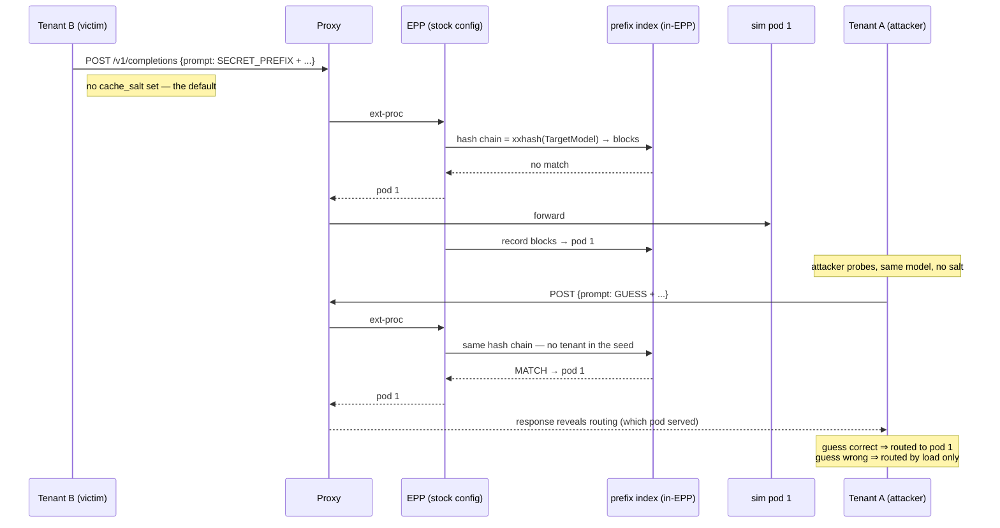

# High-Level Design — PROVENANCE

**Status:** draft · **Requirements:** `docs/design/01-requirements.md` (v0.2, approved 2026-08-29)
**Decisions log:** `docs/design/decisions.md` · **Date:** 2026-08-29

---

## 1. Overview

PROVENANCE is not a service. It is a pair of **reproducible experiment rigs** plus one
**shipped mitigation**, packaged so a reviewer can run them and a hiring manager can read
them. That framing drives every architectural choice below: there is no server to keep up,
no database to migrate, and no user to authenticate. What there is instead is a hard
requirement that every number be traceable to committed evidence (NFR-01) and that a
stranger can reproduce the GPU-free half with no accounts anywhere (P-02, D-13).

ATTEST drives a local vLLM engine through a scripted experiment matrix, records raw output,
and emits signed attestation receipts anchored to Hugging Face Hub model identity. BARRIER
stands up a two-tenant llm-d topology on kind, runs a membership oracle against it, then
runs the same oracle against a hardened configuration built on a custom EPP binary that
binds the prefix-cache salt to authenticated tenant identity.

The two share exactly one thing — a statistics library — and that sharing is deliberate and
bounded (§5.3).

---

## 2. Architecture style

**Monorepo of independent CLI tools around one shared analysis library.** No services, no
orchestrator, no message bus, no database.

| NFR | Why this style |
|---|---|
| NFR-01, P-01 | Filesystem artifacts under git are the simplest possible traceability story. A database would put published numbers behind something that can drift. |
| NFR-08, D-13 | Clone and run. Nothing to provision, no account to create. |
| NFR-11 | One `make check` over two language toolchains is tractable. A service mesh of demo components would not be. |
| §6.4 | Work is split across three environments that cannot see each other's filesystems. Self-contained CLIs that read and write files are the only thing that composes cleanly across that boundary. |

The one genuine deployable artifact is the **custom EPP container image** for BARRIER's
mitigation (§4, C5). Everything else is a script, a library, or a manifest.

**Rejected:** a web dashboard as the primary output (adds a runtime to maintain and hides
raw evidence behind rendering); a results database (contradicts NFR-01); a single
mega-CLI spanning both workstreams (couples two things that ship independently — D-04).

---

## 3. System context



**Trust boundaries.** Two matter. (1) The receipt verifier is assumed hostile to us: it
trusts the HF Hub, not our claims, which is why model identity anchors externally (D-12).
(2) Inside BARRIER's cluster, the **proxy** is the trust boundary — it authenticates the
tenant and sets the identity header. Everything behind it, the EPP included, trusts that
header *because the proxy guarantees it*. §6.4 shows why that guarantee is the whole
mitigation.

---

## 4. Components

| # | Component | Responsibility | Talks to | Owns data? |
|---|---|---|---|---|
| C1 | `attest/harness` | Drive vLLM through the staged experiment matrix; checkpoint and resume; capture raw output | vLLM, `bench/results/` | Yes — raw run output |
| C2 | `attest/receipt` | Generate, sign, verify, and replay attestation receipts; resolve model identity | HF Hub, vLLM, C1 output | Yes — receipts + public key |
| C3 | `attest/analysis` | Turn raw run output into divergence tables and cost estimates with CIs | `common/stats`, C1 output | No |
| C4 | `barrier/attack` | Membership oracle: probe, classify, score against the pre-registered bar | kind cluster, `common/stats` | Yes — raw probe traces |
| C5 | `barrier/epp` | Custom EPP binary: llm-d runner + tenant-salt plugin registered out-of-tree | llm-d Router framework | No |
| C6 | `barrier/deploy` | kind cluster, llm-d Router, ≥2 sim pods, ≥2 tenants, proxy identity config; optional observability | Docker/kind, C5 image | No |
| C7 | `common/stats` | AUC, bootstrap CIs, permutation tests, noise-floor estimation, trace replay | — | No |
| C8 | `bench/` | Experiment definitions and committed raw results with command + git SHA | All | Yes — the evidence of record |

Responsibilities do not overlap. C3 never touches an engine; C1 never computes a statistic;
C4 never decides whether a result passes (that is C7's pre-registered test).

---

## 5. Data architecture

### 5.1 Stores

There is no database. Three kinds of artifact, all files under git:

| Artifact | Location | Owner | Format | Why |
|---|---|---|---|---|
| Raw run output | `bench/results/<run-id>/` | C1, C4 | JSONL + a `manifest.json` (command, git SHA, env, timestamps) | NFR-01 requires the *unedited* output to be inspectable. JSONL appends cleanly and survives interruption (FR-A-09). |
| Attestation receipts | `bench/results/<run-id>/receipts/` | C2 | in-toto style JSON + detached ed25519 signature | D-07. Self-describing and independently verifiable. |
| Derived tables/figures | `docs/writeups/figures/` | C3 | CSV + SVG, regenerated by script | Never hand-edited. A figure with no generating script is a defect. |

**Single-writer principle:** each `run-id` directory is written by exactly one component and
is immutable once its manifest is finalised. Analysis reads; it never mutates.

`run-id` is `<workstream>-<UTC timestamp>-<git short SHA>`, which makes provenance legible
from the path alone and makes NFR-01's traceability mechanical rather than manual.

### 5.2 Resumability

C1's checkpoint model is the matrix cell: a `cells.jsonl` ledger records each cell as
`pending → running → done` with its output path. Resume = read the ledger, skip `done`,
re-run anything left `running` (assumed interrupted). This is the whole of FR-A-09, and it
is deliberately dumber than a workflow engine because it has to survive a dropped SSH
session on rented hardware.

### 5.3 The one shared contract

`common/stats` is shared by C3 and C4. It is shared because **the pre-registered
statistical bar (NFR-05) must be one implementation, not two** — if BARRIER's success test
and its mitigation test came from different code, the comparison would be worthless. Its
API is frozen at Phase 2 and is the only cross-workstream interface in the repo.

Nothing else is shared. ATTEST and BARRIER deliberately do not share config, CLI framework,
or output schema, so that D-04's sequencing works and ATTEST can ship while BARRIER is
still moving.

### 5.4 Sensitive data

No PII, no real market data, no real company names (NFR-14). Tenant fixtures are synthetic
personas ("Desk A / Desk B") and MNPI-themed prompts use invented issuers. The receipt
signing key is the one real secret; §8.2 covers it.

---

## 6. Critical flows

### 6.1 ATTEST — staged GPU session with checkpointing *(FR-A-01…04, FR-A-09)*



The decision point is a human gate inside a scripted run, not an automated branch. That is
intentional: RSK-01's outcome changes what the project claims, and that is not a judgment
to automate.

### 6.2 ATTEST — receipt generation and verification *(FR-A-05, FR-A-06, FR-A-07)*



The `--online` path is what makes this an attestation rather than a log line: identity is
confirmed against a root the validator trusts and we do not control.

### 6.3 BARRIER — the leak on the default configuration *(FR-B-03, FR-B-06)*



The leak is that the hash chain is seeded with `TargetModel` and an *optional,
client-supplied* `cache_salt` — nothing else (F-01). Two tenants on one model share one
namespace by default.

**Three failure modes of the stock control**, all demonstrated by FR-B-06:
**omission** (attacker sends no salt), **forgery** (attacker sends the victim's salt), and
**negligence** (victim never sets one — the default path above).

### 6.4 BARRIER — hardened path *(FR-B-05)*

```mermaid
sequenceDiagram
    participant TA as Tenant A (attacker)
    participant PX as Proxy (trust boundary)
    participant EPP as Custom EPP (C5)
    participant SP as tenant-salt plugin
    participant IDX as prefix index

    TA->>PX: POST {prompt: GUESS, cache_salt: "<forged tenant-B salt>"}
    Note over PX: authenticate; STRIP any client-supplied<br/>identity header and cache_salt;<br/>set x-llmd-tenant: tenant-a
    PX->>EPP: ext-proc (+ trusted identity header)
    EPP->>SP: derive salt
    SP->>SP: salt = HMAC(server_secret, tenant_id)<br/>OVERRIDES any client value
    SP->>IDX: hash chain = xxhash(TargetModel ‖ salt) → blocks
    IDX-->>EPP: no match (tenant-b namespace unreachable)
    EPP-->>PX: pod by load only
    PX-->>TA: routing carries no cross-tenant signal
```

Two properties do the work. The salt is **derived, not accepted** — so omission and forgery
both fail. And it is derived from an identity the *proxy* vouches for after authentication —
so a client cannot forge it upstream either. The header is trustworthy only because the
proxy strips the client's version; that stripping is part of the deliverable, not an
assumption (FR-B-02).

**Residual, stated plainly (FR-B-08):** this closes the EPP's routing index. Under
`precise-prefix-cache-producer` the signal also lives in the engine's real KV cache, and
closing that requires the salt to reach vLLM's own prefix cache. Whether it does is A-09,
a Phase 2 spike. We will report what we measure, not what we hope.

---

## 7. Technology stack recommendation

Confirm or override each recommendation at this gate — overrides are fine and will be
recorded in `decisions.md`.

### 7.1 Languages

| Option | Strengths | Costs / risks |
|---|---|---|
| Python + Go (two runtimes) | Forced by the domain: llm-d plugins are Go, vLLM tooling is Python | Two toolchains in `make check`, two CI matrices |
| Python only, plugin via config-only mitigation | One toolchain | Cannot ship FR-B-05 at all — the mitigation *is* Go |
| Go only | One toolchain | vLLM harness in Go means fighting the ecosystem for no gain |

**Recommendation: Python 3.12 + Go 1.24.** The split is imposed by the two upstreams, not
chosen. Discipline is to keep the boundary at the process edge — Go produces a container
image, Python produces CLIs, and they communicate only through files and HTTP. No cgo, no
bindings, no shared build.

### 7.2 Python tooling

| Option | Strengths | Costs / risks |
|---|---|---|
| **uv** | Very fast, lockfile-native, single tool for venv + deps + tool running | Younger than pip-tools; occasional churn |
| Poetry | Mature, widely known | Slower, heavier, historically awkward with torch-class deps |
| pip + requirements.txt | Universal | Weak locking; NFR-02 wants real pinning |

**Recommendation: uv.** NFR-02 demands genuine lockfiles and NFR-08 demands a fast cold
start for reviewers; uv is materially better at both, and it is already installed in the
cloud container. vLLM's own docs treat it as a first-class install path.

### 7.3 Python quality gates

| Option | Strengths | Costs / risks |
|---|---|---|
| **ruff (lint+format) + mypy --strict** | One fast tool for lint and format; mypy catches contract drift | `--strict` costs effort on scientific code |
| black + flake8 + isort | Familiar | Three tools, slower, more config |
| ruff only, no type checking | Fastest | NFR-13's coverage target protects logic; nothing protects interfaces |

**Recommendation: ruff + mypy --strict on `common/` and `attest/receipt`, standard mypy
elsewhere.** The receipt code and the statistics library are where a silent type error
would corrupt a published number; harness glue does not need the same rigour. Strictness
where it buys correctness, not everywhere.

### 7.4 Statistics

| Option | Strengths | Costs / risks |
|---|---|---|
| **numpy + scipy, AUC hand-rolled** | Small dependency surface; the test is readable and auditable in the repo | ~40 lines to write and test ourselves |
| scikit-learn `roc_auc_score` | Battle-tested, one line | Heavy dependency for one function |
| statsmodels | Rich inferential tooling | Overkill; awkward API for permutation tests |

**Recommendation: numpy + scipy with AUC, bootstrap, and permutation implemented in
`common/stats` and unit-tested against scipy reference values.** NFR-05 makes the
statistical test a headline claim of the project — a reviewer should be able to read it in
forty lines rather than trust a library call. This is one of the few places where writing
it ourselves is the *more* credible choice, and NFR-13's 80% bar applies here hardest.

### 7.5 Go plugin delivery *(resolves S-01)*

Confirmed from source: `plugin.Register(type, stability, FactoryFunc)` writes to an exported
package-level `Registry`, and `runner.NewRunner()…Run(ctx)` is exported.

| Option | Strengths | Costs / risks |
|---|---|---|
| **Out-of-tree module importing the runner** | No fork. Our `main.go` blank-imports our plugin package, whose `init()` calls `Register`, then runs upstream's runner. Upgrades are a go.mod bump | Must track runner API across releases |
| Fork llm-d-router | Total control | Permanent merge burden; reviewers discount a forked demo |
| Config-only, no custom code | Nothing to build | Cannot express identity binding — the mitigation does not exist |

**Recommendation: out-of-tree Go module producing a custom EPP image.** This is how the
framework is built to be extended, it keeps the diff reviewable (our plugin is the only
code we own), and "here is a plugin you can drop into your own EPP build" is a far stronger
artifact than "here is my fork." Retires most of A-05.

### 7.6 Container build

| Option | Strengths | Costs / risks |
|---|---|---|
| **ko** | Purpose-built for Go; no Dockerfile; reproducible, small, fast; trivial kind loading | Go-only (fine — C5 is our only image) |
| Docker multi-stage | Universal, familiar | Slower; a Dockerfile to maintain |
| Upstream `Dockerfile.epp`, patched | Matches upstream | Couples us to their build; patching is fork-shaped |

**Recommendation: ko.** NFR-08's 30-minute budget is mostly image build and cluster
bring-up; ko removes most of it, and reproducible image digests serve NFR-02 directly.

### 7.7 Local cluster

| Option | Strengths | Costs / risks |
|---|---|---|
| **kind** | What llm-d ships tooling for (`Makefile.kind.mk`); Docker Desktop is present and confirmed | Multi-node is simulated, not real |
| k3d | Lighter, fast | Diverges from upstream's supported path |
| minikube | Mature | Heavier; weaker upstream alignment |

**Recommendation: kind, built on upstream's `Makefile.kind.mk`.** Using the project's own
dev tooling is itself evidence of having operated the stack, and it removes a class of
"my cluster is different" failure. FR-B-02 already requires it.

### 7.8 Deployment manifests

| Option | Strengths | Costs / risks |
|---|---|---|
| **Helm, thin values over upstream charts** | Matches how llm-d is actually deployed; values files read as configuration a customer would recognise | Templating opacity when debugging |
| Kustomize overlays | Transparent; clean default-vs-hardened diff | Diverges from upstream's distribution |
| Raw YAML | Maximally legible | Duplication between the two configurations |

**Recommendation: Helm with two values files — `values-default.yaml` and
`values-hardened.yaml`.** The *diff between those two files is the deliverable*: it shows a
reader exactly what changes to close the channel. That legibility is worth more here than
templating purity.

### 7.9 Task runner and CI

**Recommendation: `make` + GitHub Actions**, one `make check` target spanning both
toolchains (NFR-11), with CI running `make check` *and* `make barrier-demo` on every push
(NFR-12). `just` is nicer; `make` is what upstream uses and what a reviewer expects. CI that
actually runs the attack is the credibility artifact — a badge that only lints is noise.

### 7.10 Receipt signing

| Option | Strengths | Costs / risks |
|---|---|---|
| **ed25519 via `cryptography`, in-toto predicate** | Offline verification, no infrastructure, recognisable shape | We own key custody |
| Sigstore keyless (cosign) | No key custody; strong provenance story | Requires network + OIDC at verify time — breaks FR-A-06's offline requirement and D-13 |
| GPG | Ubiquitous | Awkward API, poor UX, weaker modern posture |

**Recommendation: ed25519 + in-toto predicate**, with a documented path to sigstore as
future work. FR-A-06 requires offline verification with no network and no account; that
rules out keyless today. Key handling in §8.2.

### 7.11 Summary

| Layer | Choice |
|---|---|
| Languages | Python 3.12, Go 1.24 |
| Python deps | uv + lockfile |
| Python gates | ruff, mypy (strict on `common/`, `attest/receipt`) |
| Statistics | numpy + scipy; AUC/bootstrap/permutation owned in `common/stats` |
| Go plugin | Out-of-tree module importing upstream runner |
| Image | ko |
| Cluster | kind via upstream `Makefile.kind.mk` |
| Manifests | Helm, `values-default` vs `values-hardened` |
| Runner / CI | make + GitHub Actions (`make check` + `make barrier-demo`) |
| Signing | ed25519 + in-toto |
| Observability *(impressive tier)* | kube-prometheus-stack, self-hosted |

---

## 8. Cross-cutting concerns

### 8.1 Authentication and authorization

Only BARRIER has an authn model, and it exists to be *studied*, not to protect anything
real. Tenants are API keys mapped to identities at the proxy. The proxy authenticates,
**strips any client-supplied identity header and `cache_salt`**, and injects a trusted
`x-llmd-tenant`. Confirmed viable: several shipped scheduling plugins already read request
headers, so the identity reaches plugin code at scheduling time — which substantially
de-risks RSK-05.

The stripping step is load-bearing and is called out in the threat model: without it, the
mitigation is forgeable at the edge and the whole result collapses.

### 8.2 Configuration and secrets

Config is files, not environment sprawl: experiment matrices and deployment values are
committed YAML; only credentials come from the environment.

Three secrets exist. **Receipt signing key** — generated per run, private key never
committed, public key committed alongside receipts so verification needs nothing else; CI
uses a fixed, clearly-labelled test key for fixtures, and the tooling refuses to sign a
non-test receipt with it. **Tenant API keys** — synthetic, generated at deploy, gitignored.
**EPP salt secret** — a cluster Secret; the writeup notes that in production this is a
rotation concern and that rotation invalidates warm cache, which is a real operational cost
worth naming.

### 8.3 Logging, metrics, tracing

Structured JSONL to stdout from every CLI; the run manifest captures the invocation. No
tracing — there is no distributed request path we own. Metrics are scraped from llm-d and
the simulator, which already export Prometheus; FR-R-08 renders them, and nothing in the
MVP depends on that rendering.

**Never logged:** signing private keys, tenant API keys, the EPP salt secret, or derived
per-tenant salts. A derived salt in a log is a forgeable credential — this belongs in the
secrets scan (NFR-14).

### 8.4 Error handling

**Fail fast and loudly** everywhere. This is measurement code: a silently degraded run
produces a plausible wrong number, which is the worst possible outcome for a project whose
entire value is credibility. Specifically — a cell that errors is recorded as `failed` with
its exception and excluded from analysis rather than retried into the dataset; `attest
verify` distinguishes *tampered*, *malformed*, and *cannot reach Hub*, never collapsing
them into a single failure; and any analysis over an incomplete matrix refuses to emit a
headline number and says which cells are missing.

The one place degradation is allowed: `verify --online` falls back to offline verification
with an explicit warning, because a validator without network still deserves an answer.

### 8.5 Caching

Deliberately minimal, and the reasoning is not incidental — this is a project *about*
caches. Model weights cache in the standard HF cache. Hub identity lookups are cached per
run, never across runs, so a receipt can never be signed against stale identity. **vLLM's
prefix cache is pinned off for ATTEST** (D-06) and its state is recorded in every receipt.

---

## 9. Non-functional design

| NFR | How the architecture meets it |
|---|---|
| NFR-01 | `run-id` directories carry command + git SHA in a manifest; figures regenerate from committed raw output by script |
| NFR-02 | uv lockfile, go.sum, ko digest pinning, recorded vLLM SHA, pinned chart versions |
| NFR-03 | Matrix and schedule are pure functions of seed + config; covered by unit tests |
| NFR-04 | Noise floor measured in Stage 1 and committed; workloads replay published traces via `common` |
| NFR-05 | One implementation in `common/stats`, frozen at Phase 2, used by both success and mitigation tests |
| NFR-06 | Cell-level ledger permits partial progress; cheapest cells first; 2h reserve |
| NFR-07 | kind + simulator only; no model weights on the demo path |
| NFR-08 | uv + ko + upstream kind tooling; no accounts (D-13) |
| NFR-09 | Simulator pods are lightweight; observability optional and off by default |
| NFR-10 | Verification is signature + hash comparison; `--online` adds one Hub call |
| NFR-11 | Single `make check` fans out to ruff/mypy/pytest and gofmt/golangci-lint/go test |
| NFR-12 | Same target in CI, plus `make barrier-demo` |
| NFR-13 | Coverage enforced on `common/stats`, `attest/receipt`, `barrier/epp` |
| NFR-14 | Secrets scan in `make check`; synthetic fixtures only; derived salts never logged |
| NFR-15 | `uv pip audit` and `govulncheck` in the gate ladder |
| NFR-16 | Writeups carry a prior-art section (PrefixWall, DualMap) — a template section, so it cannot be forgotten |
| NFR-17 | Analysis emits "no effect observed" as a first-class result with the same rigour as a positive one |
| NFR-18 | The hardened Helm values are a *configuration* delta plus a plugin, framed as posture, not patch |
| NFR-19 | `00-upstream-findings.md` re-verified at Phase 4 start |

---

## 10. Risks and mitigations

| # | Risk | Mitigation |
|---|---|---|
| R-1 | **RSK-01** — no divergence at small model size | Staged GPU session with a human decision point (§6.1); NFR-17 makes the negative result shippable |
| R-2 | **RSK-02** — simulator exposes no usable routing signal | Phase 2 spike S-02 before the LLD freezes; fallback to FR-B-09 on real vLLM |
| R-3 | **A-09** — `cache_salt` may not reach vLLM's own prefix cache | Phase 2 spike; scope of FR-B-08 adjusts to what is measured. Does not affect the routing-index result |
| R-4 | Upstream runner API drift breaks the out-of-tree module | Pin the module version; `make check` compiles against the pin; upgrades are deliberate |
| R-5 | Proxy cannot be configured to strip client headers | Would move the trust boundary; identified early because FR-B-02 requires the stripping config to exist before the attack runs |
| R-6 | Two toolchains inflate CI beyond the 5-minute budget | Cache uv and Go module caches; keep the demo on the simulator; split `check` from the longer demo job if needed |
| R-7 | Scope creep from impressive-tier items | FR-R-07 and FR-R-08 are explicitly gated behind ATTEST MVP (§10.3 of requirements) |

---

## 11. Explicitly out of scope

Per requirements §8, and reaffirmed architecturally: no service to run, no database, no
hosted anything in the reproduction path, no fork of llm-d, no web UI as primary output.
The impressive-tier HF Space (FR-R-07) is a *mirror* of the local demo, never the source of
truth for any number.
